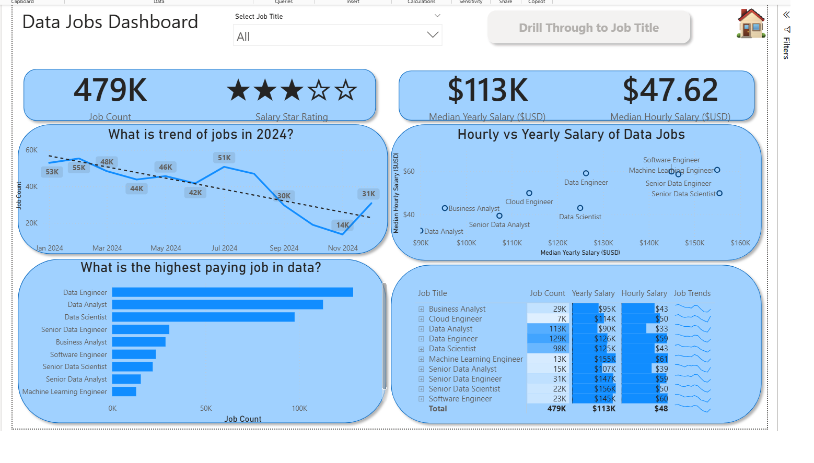

# Data Jobs Dashboard w/ Power BI

## Introduction
This dashboard was created for job seekers, job transitioners, and data enthusiasts to solve a common problem: understanding the data job market.  
Job market information is often scattered and hard to grasp. Using real-world job posting data, this project provides a single, interactive interface to explore market trends, job demand, locations, and compensation.

---

## Dashboard Overview
The report is divided into multiple pages to help users move from a high-level overview to detailed insights.

### Page 1: High-Level Market View
This page provides a snapshot of the overall data job market:
- Total number of job postings
- Average yearly and hourly salaries
- Global distribution of data jobs using a map visual
- Breakdown of job types and work arrangements

This view helps users quickly understand the current state of the data job market.

---

### Page 2: Job Title Drill Through
This page allows users to drill through from the main dashboard to analyze specific job titles.
Users can explore:
- Job locations by country and region
- Salary distribution for a selected role
- Hiring platforms posting the most jobs
- Types of employment (full-time, contract, remote, etc.)

This page enables deeper analysis for individual roles such as Data Analyst, Data Engineer, or Data Scientist.

---

## Skills Showcased

### Data Transformation (ETL)
- Cleaned and transformed raw job posting data using Power Query
- Removed duplicates and handled missing values
- Created new calculated columns for analysis

### DAX & Measures
- Created measures to calculate average salaries, job counts, and KPIs
- Used DAX to support dynamic filtering and drill-through functionality

### Data Visualization
- Used maps to visualize global job distribution
- Created KPI cards for quick insights
- Built bar charts, donut charts, and tables for comparison analysis

### Dashboard Design
- Designed a clean, intuitive, and visually consistent layout
- Used slicers to allow dynamic filtering by job title, location, and platform
- Implemented drill-through for a smooth user experience

---

## Tools Used
- Power BI Desktop
- Power Query
- DAX
- Excel / CSV Dataset

---

## How to Use
1. Download the `.pbix` file from this repository  
2. Open it using Power BI Desktop  
3. Use slicers and drill-through features to explore insights interactively

---

## Conclusion
This project demonstrates how Power BI can transform raw job posting data into meaningful insights.  
It highlights market trends, helps job seekers make informed decisions, and showcases practical Power BI skills including data modeling, DAX, and dashboard design.
