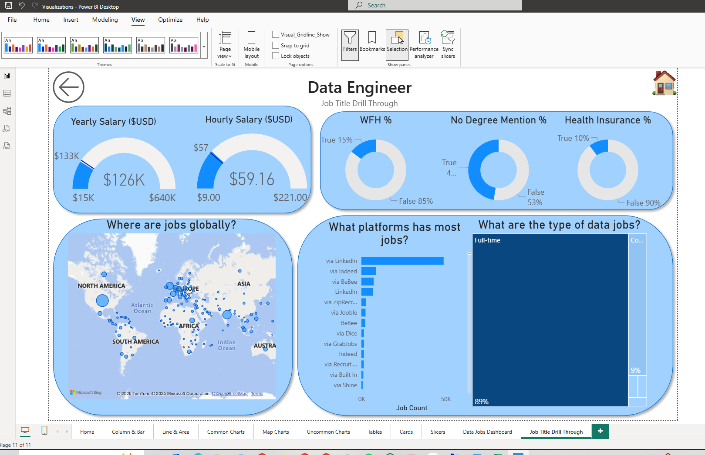

# PowerBI-Job-Market-Analysis

## Overview
This Power BI project analyzes global job market trends including
locations, salaries, platforms, and job types.

## Tools Used
- Power BI Desktop
- Excel / CSV
- Data Visualization

## Key Insights
- Global distribution of jobs
- Average yearly and hourly salaries
- Most popular job platforms
- Types of data-related jobs

## Dashboard Preview

## How to Use
Download the .pbix file and open it in Power BI Desktop.
